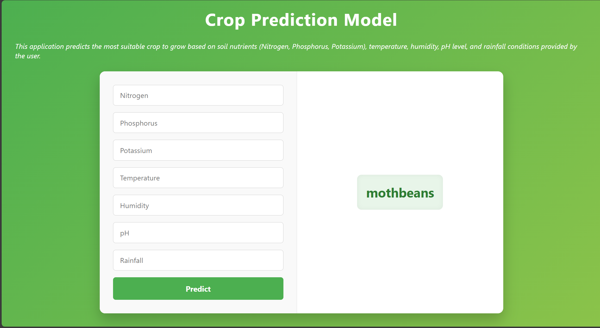

# Crop recommendation flask application

A Flask web application that serves a machine learning model. The system uses machine learning to recommend an optimal crop based on user-provided soil and environmental parameters.  

## 🚀 Features

- Flask web app for model inference
- Template rendering with Jinja2
- Pre-trained model included

## 📦 Installation

- Python 3.12
- Flask
- HTML / CSS
### steps
Clone the repository in a forder

`git clone https://github.com/koffibenyamin/crop-Recommendation.git`

`cd crop-Recommendation`

Create a virtual environment

`python -m venv venv`

Activate the virtual environment

`venv\Scripts\activate`

Create flask project

`pip install flask`
## ▶️ Running the App
`flask run`

Then open your browser and visit:
`http://127.0.0.1:5000/`

## 📸 Screenshots

## 📄 License

This project is open-sourced under the **MIT license**.

